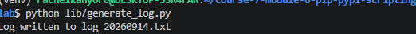
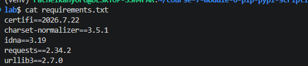

# Module Lab: Automating Python Projects with Pip, PyPI & Scripting

## Description

This project demonstrates how Python can be used to automate a small task using an external package installed with pip.

The automation script uses the `requests` package to retrieve data from an external API and then writes structured information to a timestamped text file.

## Learning Goals

This project demonstrates how to:

- Automate tasks using Python scripts.
- Install and use third-party packages with pip.
- Use an external API with the `requests` package.
- Write data to a local text file.
- Create timestamped output files.
- Track project dependencies using `requirements.txt`.
- Use functions to organize Python code.
- Use `if __name__ == "__main__"` to create a reusable script.

## Project Features

The script:

1. Starts the automation process.
2. Sends a request to the JSONPlaceholder API.
3. Retrieves post information.
4. Displays the post title.
5. Creates a timestamped log file.
6. Writes log information and API data into the file.
7. Prints messages confirming the operation.
8. Handles API request errors.

## Project Structure

```text
module-lab-pip-pypi-scripting/
├── generate_log.py
├── requirements.txt
├── README.md
└── log_YYYYMMDD_HHMMSS.txt
```

## Technologies Used

- Python 3
- pip
- PyPI
- requests
- File I/O
- JSONPlaceholder API
- Git
- GitHub

## Installation

Clone the repository and enter the project directory.

```bash
git clone <your-repository-url>
cd module-lab-pip-pypi-scripting
```

Install the dependencies:

```bash
python3 -m pip install -r requirements.txt
```

## Running the Script

Run the automation script from the command line:

```bash
python3 generate_log.py
```

The script will fetch data from the API and create a timestamped text file.

Example:

```text
Starting Python automation...
Fetched Post Title: ...
Log written to log_YYYYMMDD_HHMMSS.txt
Automation completed successfully.
```

## Generated Output

The generated text file contains log information and the title retrieved from the API.

Example:

```text
User logged in
User updated profile
Report exported
Fetched Post Title: ...
```

## Dependencies

The project's external Python dependencies are recorded in:

```text
requirements.txt
```

The dependency file can be regenerated using:

```bash
python3 -m pip freeze > requirements.txt
```

## Error Handling

The script uses `requests.RequestException` to handle problems that may occur while communicating with the external API.

This allows the script to display an error message instead of stopping unexpectedly.

## Code Structure

The script separates different responsibilities into functions:

- `fetch_data()` retrieves information from the API.
- `write_log()` creates and writes to the output file.
- `main()` controls the automation process.

The script uses:

```python
if __name__ == "__main__":
```

so that the main automation process runs when the file is executed directly.

## Screenshot

A screenshot showing the successful execution of the script is included below.




## Learning Outcome

This lab provided practical experience with Python automation, pip package management, external APIs, file handling, dependency tracking, and command-line scripting.

## Author

Rachel Kanyoro
